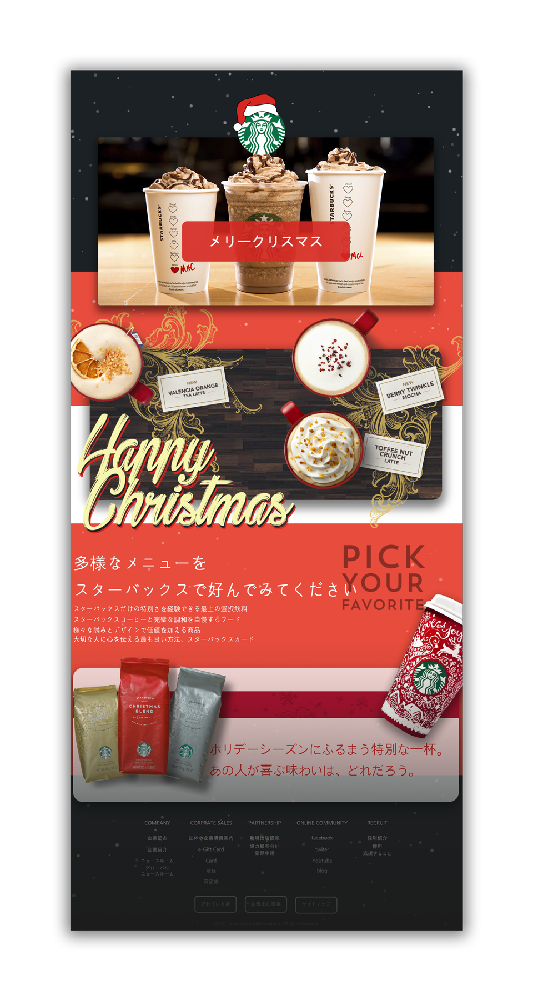

  

# portfolio-starbucks
스타벅스 리디자인

 

## Content

### 새롭게 디자인 할 웹사이트 정하기

[일본 스타벅스 공식사이트](https://www.starbucks.co.jp/)

### 위 사이트를 고은 이유는 무엇인가?

세계적 커피체인점 브랜드 웹디자인은 어떠한가?

대체로 여러 나라의 스타벅스 웹디자인은 깔끔하고 스타벅스만의 개성이 뚜렷하게 나타났다 근데 일본의 스타벅스 홈페이지만 유독 다르고 디자인이 이렇방식이 아니라 원 페이지로 깔끔하고 일본만의 느낌이랑 대부분의 스타벅스 홈페이지와 비슷한 느낌으로 만들면 어떨까 하는 생각으로 일본 스타벅스 홈페이지를 선택하게 되었다.

### 내가 생각하는 선택한 사이트의 문제점은 무엇인가?

대부분 사용자들은 메뉴를 시각적인 면으로 처음 접하고 시각적 이미지들을 클릭해서 이동하는 방식을 선호하고 편리해 한다 하지만 사이트의 메인 이미지 빼고 대부분이 글로 내용으로 사용자를 유도하는 방식이라 문제가 된다 생각한다.

### 이런 문제점을 어떻게 표현하여 보완할 것인가?

시각적 이미지를 주로 사용하여 사용자가 내용을 편하고 이미지 한 장으로 여러 내용을 한 번에 인식시켜줄 수 있는 방법으로 문제점을 해결해보려 한다.

### 리디자인으로 새롭게 표현하고 싶은 부분은 무엇인가?

깔끔함과 스타벅스만의 느낌을 웹페이지에 녹아들게 하고 크리스마스 시즌이라 크리스마스의 분위기를 담는다.

## 피드백, 보완점

[📎 Link](https://github.com/Hansanghyeon/portfolio-starbucks/issues?q=is%3Aissue+sort%3Aupdated-desc+label%3AFeedBack+)